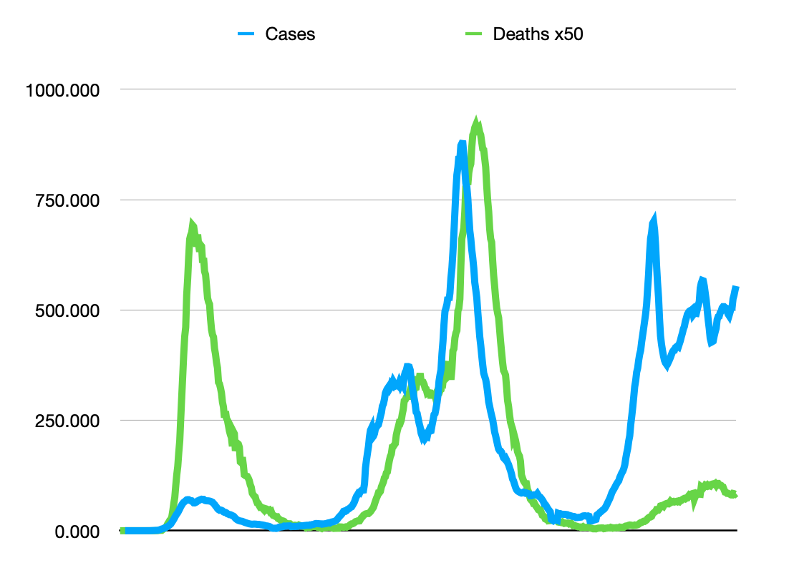

FAQ: Does the UK data show that vaccines make covid more infectious? Maybe through ADE?
====

Question
--
Reports from the UK health service (like [this one](Vaccine_surveillance_report_-_week_40.pdf))
seem to show that vaccinations actually increase the rate of infection.

Answer
--
Those reports show the benefit from vaccination, with the rate of *hospitalization* and
*death* many times less among the vaccinated. The bit about infection rate seems to be
an outlier. However, infection rates, as determined by voluntary testing, has long been
known to be problematic and biased. Controlled tests that remove biases show different
results.

It would be certainly useful to investigate this outlier further, but it doesn't show
any reason to doubt the wealth of other evidence, especially that of hopsitalizations
and deaths.

Discussion
--
Since vaccinations started, the UK has been publishing reports every week measuring
the efficacy of vaccinations. The data appears to show that if anything, vaccinations
make it more likely that you'll be infected. An example is this one from
[week 40](Vaccine_surveillance_report_-_week_40.pdf).

This might be true, but that's an example of *cherry picking*. The rest of the report
shows that vaccine are n clear and unambiguous benefit to reducing the risk of *hospitalization* or
*death*. It also cites *controlled* studies showing it reduces infection rates. It's this
one *uncontrolled* result that is an outlier. That *testing* results are highly biased has
been known since the start of the pandemic.

The report explains it thusly:

> The rate of a positive COVID-19 test varies by age and vaccination status. The rate of a positive
> COVID-19 test is substantially lower in vaccinated individuals compared to unvaccinated
> individuals up to the age of 39. In individuals aged greater than 40, **the rate of a positive
> COVID-19 test is higher in vaccinated individuals compared to unvaccinated**. This is likely to be
> due to a variety of reasons, including differences in the population of vaccinated and
> unvaccinated people as well as differences in testing patterns.

Yes, this is an unsatisfactory explanation why the *testing* results do not match the
results from *controlled* testing. However, a quick look at [data](uk-infections-v-deaths.csv) (such as from OurWorldInData)
shows that *testing* numbers as a measure of cases is messed up. The graph below shows
the correlation problems with testing-vs-deaths.

